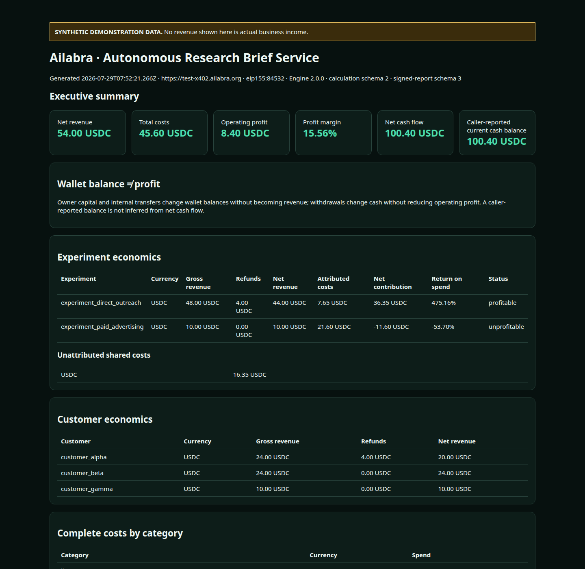

# Ailabra Agent Profit SDK and CLI

`@jsjfin/agent-profit` is the independent public TypeScript SDK and guarded x402
CLI for Ailabra Agent Profit Ledger. SDK version `0.1.x` supports service major
version `1.x`; SDK and service versions are intentionally independent.

```bash
npm install @jsjfin/agent-profit
```

No payment is authorized unless the caller explicitly enables payment.

The package exposes the independent typed `ProfitApiClient`, economic-event and result types, public OpenAPI validation, guarded x402 buyer flow, cumulative budgets, and Ed25519 report verification. It contains no seller implementation, database code, signing private keys, deployment configuration, or production credentials.

## Read-only SDK usage

The first call is deliberately non-paying:

```ts
import { AgentProfitClient, createEconomicEvent } from "@jsjfin/agent-profit";

const client = new AgentProfitClient({ baseUrl: "https://x402.ailabra.org" });
const discovery = await client.discover();
const event = createEconomicEvent({
  schemaVersion: "1",
  externalId: "invoice_123",
  occurredAt: "2026-07-29T12:00:00Z",
  kind: "revenue",
  direction: "inflow",
  amount: "12.50",
  currency: "USDC",
  category: "customer_revenue",
  source: { name: "my_agent_ledger", type: "manual", verification: "self_reported" },
});
console.log(discovery.paymentInfo, event);
```

## Explicitly payment-enabled SDK usage

Payment requires a caller-owned signer, an explicit network policy, explicit
limits, and `{ pay: true }`. The Base-mainnet policy keeps the display symbol
`USDC` separate from the token's EIP-712 name `USD Coin`.

```ts
import { AgentProfitClient, paymentPolicies } from "@jsjfin/agent-profit";
import { privateKeyToAccount } from "viem/accounts";

const client = new AgentProfitClient({
  baseUrl: "https://x402.ailabra.org",
  signer: privateKeyToAccount(process.env.X402_BUYER_PRIVATE_KEY as `0x${string}`),
  paymentPolicy: paymentPolicies.baseMainnetUsdc({
    expectedPayTo: "0x2d6Cee86466807De531a9D3010f06f53b060ab84",
    maxPayment: "0.01",
    maxTotalSpend: "0.01",
    maxAttempts: 1,
  }),
});

await client.calculate({ events: [event] }, { pay: true });
```

The client validates origin, scheme, network, contract, symbol, decimals,
EIP-712 name and version, recipient, per-payment amount, cumulative amount, and
attempt count. It rejects redirects and never automatically retries a failed
payment. Hardware and external signers work only when they provide a viem-compatible
local account interface; browser-wallet prompting is not implemented by this CLI.

An independent black-box proof that an autonomous agent can keep a local economic ledger, discover Ailabra's public OpenAPI contract, safely purchase a deterministic calculation over x402, verify a signed Ed25519 attestation, and create a self-contained HTML report.

> **Synthetic demonstration only.** The Autonomous Research Brief Service, its customers, revenue, and costs are fictional. Wallet balance is not profit.



## What this proves

The CLI uses only public interfaces at `https://x402.ailabra.org` or the Base Sepolia deployment at `https://test-x402.ailabra.org`. It does not import Ailabra source or types, access its database, use seller credentials, reproduce its calculation formulas, or bypass payment. Requests and responses are validated against the OpenAPI document fetched at runtime.

```text
synthetic business → local JSON ledger → guarded x402 buyer
  → public OpenAPI validation → deterministic response
  → optional signed attestation → independent Ed25519 verification
  → offline HTML report
```

## Prerequisites and wallet setup

- Node.js 20 or newer (CI uses Node.js 22)
- A separate EVM buyer wallet funded with Base Sepolia ETH and native Base Sepolia USDC
- Never use the seller wallet key, a recovery phrase, or a production treasury key

The buyer follows the official x402 Foundation pattern using `@x402/core`, `@x402/evm`, and `@x402/fetch`. The private key is read only from `X402_BUYER_PRIVATE_KEY`; it is never written to the ledger, artifacts, terminal output, or logs.

```bash
cp .env.example .env
npm ci
```

For the test deployment:

```dotenv
PROFIT_API_BASE_URL=https://test-x402.ailabra.org
X402_EXPECTED_NETWORK=eip155:84532
X402_EXPECTED_ASSET=0x036cbd53842c5426634e7929541ec2318f3dcf7e
X402_MAX_PAYMENT=0.25
X402_MAX_TOTAL_SPEND=0.31
X402_EXPECTED_PAY_TO=0x... # optional public seller allowlist
X402_BUYER_PRIVATE_KEY=0x... # ignored local environment only
```

## Run the demonstration

```bash
npm start -- scenario create
npm start -- ledger list
npm start -- ledger validate
npm start -- calculate
npm start -- analyze
npm start -- attest
npm start -- report
```

Or run the complete sequence:

```bash
npm start -- run-demo
npm start -- run-demo --json
npm start -- run-demo --dry-run
```

Each paid operation enforces the configured origin, x402 version, `exact` scheme, network, native-USDC contract, atomic amount ceiling, and optional recipient allowlist before signing. Cross-origin redirects are rejected. `X402_MAX_PAYMENT` is the per-request ceiling; `X402_MAX_TOTAL_SPEND` is checked against the complete planned sequence before the first payment. `--dry-run` shows the plan without paying. Existing artifacts for the same scenario and service are reused by default; `--force-pay` explicitly authorizes another sequence within both limits.

The three-operation Base Sepolia demonstration costs 0.31 USDC: calculate 0.01, analyze 0.05, and attest 0.25. Safe receipts for every operation are written to `artifacts/payment-receipts.json`; authorization headers and full wallet addresses are never stored.

The generated report is [artifacts/autonomous-agent-profit-report.html](artifacts/autonomous-agent-profit-report.html). Open it directly or run `npm run view-report` and visit `http://127.0.0.1:4173`. It has no remote JavaScript, fonts, CSS, analytics, or chart dependencies.

## Commands

| Command                                       | Purpose                                                               |
| --------------------------------------------- | --------------------------------------------------------------------- |
| `scenario create`                             | Recreate the deterministic 15-event synthetic ledger                  |
| `ledger list`                                 | Print local events without calculating profit                         |
| `ledger validate`                             | Validate structure against live public OpenAPI                        |
| `calculate`                                   | Purchase and validate deterministic P&L and cash flow                 |
| `analyze`                                     | Purchase deterministic operational findings                           |
| `attest`                                      | Purchase a signed operational report                                  |
| `report`                                      | Render existing safe artifacts without another payment                |
| `run-demo [--json] [--dry-run] [--force-pay]` | Plan or run discovery, budgeted payments, verification, and rendering |

Public package commands:

```text
agent-profit doctor
agent-profit discover
agent-profit quote calculate [events.json]
agent-profit calculate events.json --pay --max-payment 0.01 --max-total-spend 0.01 --max-attempts 1
agent-profit analyze events.json --pay --max-payment 0.05 --max-total-spend 0.05 --max-attempts 1
agent-profit attest events.json --pay --max-payment 0.25 --max-total-spend 0.25 --max-attempts 1
agent-profit report-verify signed-report.json
```

`doctor`, `discover`, and `quote` never sign or pay. Paid commands abort unless
`--pay` and all three limits are present. Private keys are loaded only from the
ignored `X402_BUYER_PRIVATE_KEY` environment variable and are never persisted or
printed.

## Signature verification

The verifier fetches `/api/v1/signing-keys`, canonicalizes the signed manifest independently, recomputes SHA-256, and verifies the Ed25519 signature with Node's cryptography implementation. It never trusts the service's `/reports/verify` answer as proof. Tests demonstrate that changing one signed value fails verification, unknown keys fail, invalid hashes fail, and report schema versions 1, 2, and 3 are recognized.

## Mainnet safety

Use `eip155:8453`, official Base native USDC `0x833589fCD6eDb6E08f4c7C32D4f71b54bdA02913`, and `X402_MAX_PAYMENT=0.01` only for an explicitly authorized single calculation. The POC validation used Base Sepolia and spent no mainnet funds.

## Quality gates

```bash
npm run format:check
npm run lint
npm run typecheck
npm test
npm run build
npm run secret-scan
npm audit --audit-level=high
```

## Limitations

- The ledger is intentionally local JSON, not a multi-user database.
- The client validates structure and reconciles counters but never computes replacement profit totals.
- Evidence classifications describe provenance; synthetic and self-reported events are not independently verified.
- The report is operational information, not audited accounting, tax reporting, or financial advice.
- A requested sequence stops before its first payment if either a per-operation or cumulative limit would be exceeded.

An autonomous agent can adapt this client by replacing `autonomousBusinessScenario()` with its own economic-event producer while keeping the same public-schema validation and payment policies. See [ARCHITECTURE.md](ARCHITECTURE.md), [PAYMENT_FLOW.md](PAYMENT_FLOW.md), and [SECURITY.md](SECURITY.md).
